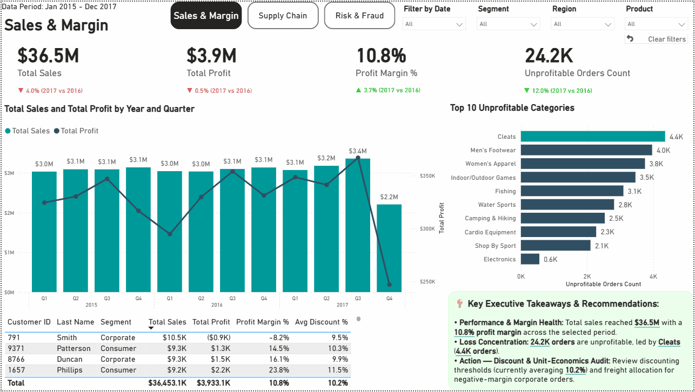
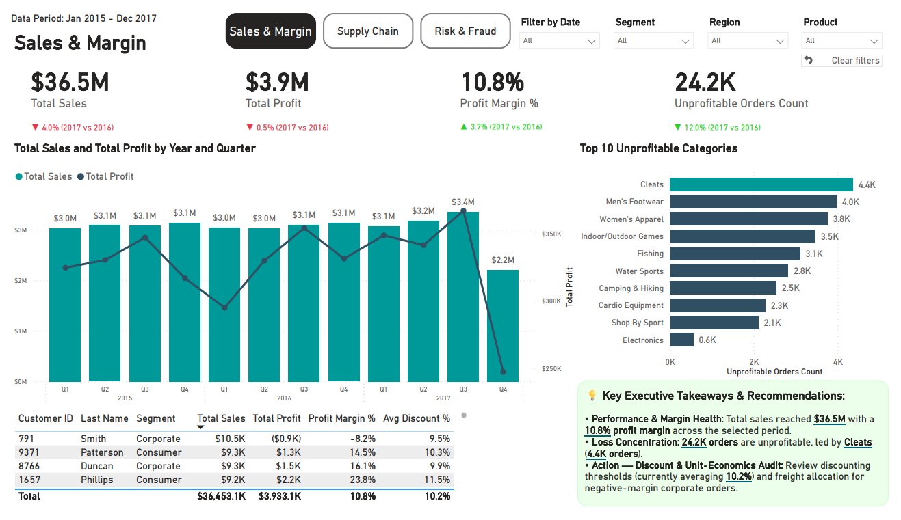
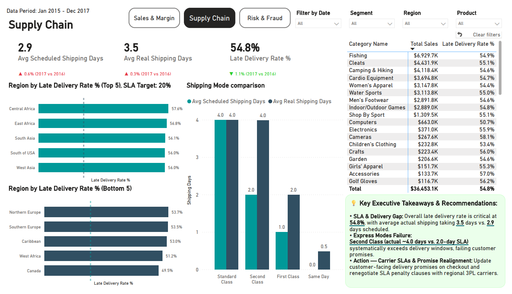
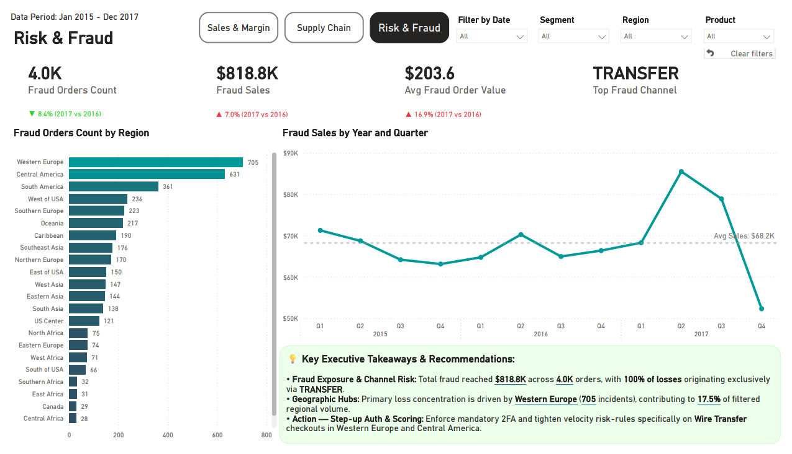
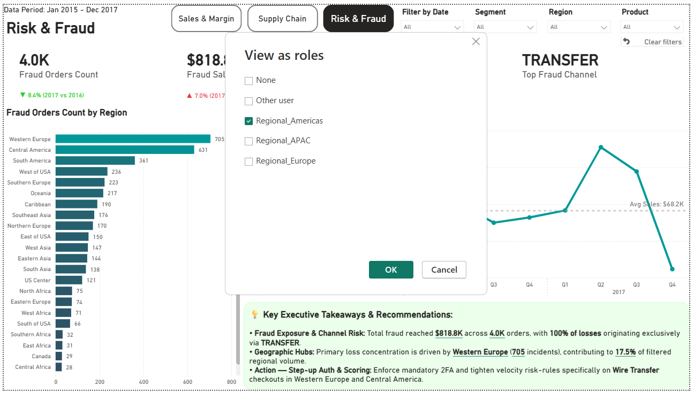
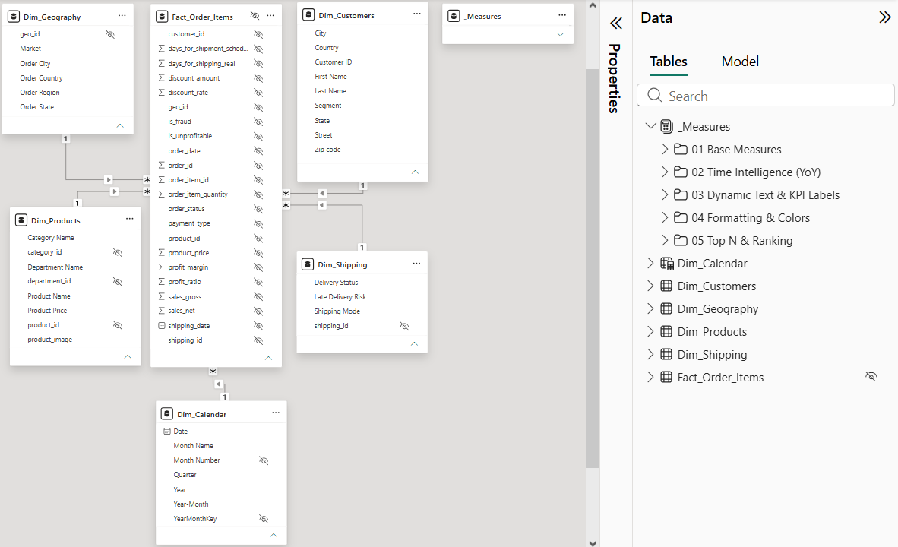

# Enterprise Supply Chain, Margin & Risk Intelligence Solution




---

An end-to-end, enterprise-grade Data Warehousing and Business Intelligence solution engineered on the **DataCo Global Supply Chain** dataset (180.5K+ transactional records). 

The platform bridges relational data engineering in **PostgreSQL** with high-density analytical dashboards in **Power BI**, providing C-suite and Operations leadership with real-time visibility into revenue leakages, systemic SLA logistics bottlenecks, and cross-border payment fraud.

---

## 🔗 Live Demo & Project Assets
* **Power BI Production Workbook:** [Download .pbix File](pbix/Supply_Chain_Analytics.pbix)
* **Executive Summary Document:** [Download PDF Report](Supply_Chain_Analytics.pdf)
* **Author LinkedIn:** [Szymon Khrapachenko](https://www.linkedin.com/in/szymon-khrapachenko)

---

## 🖥️ Dashboard Architecture & Strategic Insights

The reporting layer consists of three domain-specific analytical engines with synchronized cross-filtering, bookmark navigation, and dynamic Smart Narrative generation:

### 1. Sales & Margin Optimization (Commercial Unit Economics)
* **Strategic Focus:** Bottom-line health, corporate discount audit, and SKU profitability leakage.
* **Key Executive Takeaways:**
  * Total revenue achieved **$36.5M** with a healthy aggregate profit margin of **10.8%** ($3.9M Net Profit).
  * Isolated **24.2K unprofitable orders**, with losses heavily concentrated in the **Cleats** category (**4.4K unprofitable orders** generating -$0.9K in negative margin for top corporate buyers).
  * **Prescriptive Action:** Enforced discount threshold restructuring (capping average discounts at **10.2%**) and dynamic freight allocation for negative-margin corporate accounts.



### 2. Supply Chain & Logistics SLA Control
* **Strategic Focus:** Carrier performance auditing, scheduled vs. actual transit times, and delivery breach mitigation.
* **Key Executive Takeaways:**
  * Global late delivery rate reached a critical **54.8%** (breaching the enterprise SLA target of **20.0%**), with average actual delivery taking **3.5 days vs. 2.9 days scheduled**.
  * **Root-Cause Bottleneck:** Systemic carrier failure in **Second Class shipping** (actual **~4.0 days vs. 2.0-day SLA promise**).
  * **Prescriptive Action:** Recalibrated checkout promise algorithms and structured SLA penalty clauses with regional 3PL logistics carriers.



### 3. Risk & Fraud Detection Intelligence
* **Strategic Focus:** Exposure auditing, illicit payment channel identification, and geographic fraud clustering.
* **Key Executive Takeaways:**
  * Identified **$818.8K in fraud exposure** across **4.0K transactions** (Avg. fraud order value of **$203.6**).
  * **Channel & Territory Vulnerability:** **100% of all fraudulent transactions** originated exclusively through the **TRANSFER** payment channel, with **Western Europe (705 incidents)** and **Central America (631 incidents)** acting as primary vectors.
  * **Prescriptive Action:** Enforced mandatory Step-up 2FA and tightened transaction velocity risk rules exclusively on Wire Transfer transactions in high-risk zones.



---

## 🔐 Enterprise Security & Access Governance (Row-Level Security)

To satisfy enterprise regulatory compliance and data governance standards, dynamic **Role-Based Access Control (RBAC)** was implemented using dimensional Row-Level Security (RLS) predicates:

* **Role Isolation:** `Regional_Americas`, `Regional_Europe`, `Regional_APAC`.
* **Mechanism:** Single-direction 1:N relationship filtering on `core.dim_geography[market]`, isolating regional transactional exposure across all three analytical domains automatically.



---

## 🏗️ Data Architecture & DWH Engineering (PostgreSQL)

The underlying storage layer was engineered using an ELT/ETL pattern with a clean **3-Tier Schema Architecture** in PostgreSQL:

1. **`raw` (Staging Layer):** Ingestion of source records (`raw.staging_dataco`).
2. **`core` (Enterprise Star Schema):** Normalization of high-cardinality entities into conformed dimensions and an optimized fact table with primary/foreign key constraints.
3. **`analytics` (Consumption Data Marts):** High-performance analytical views pre-aggregating window metrics for Power BI Direct/Import modes.

```text
       [ raw.staging_dataco ] (180,519 rows)
                 │
                 ▼  (ETL Transformations & Dimensional Deduplication)
  ┌───────────────────────────────────────────────────────────┐
  │                   core (Star Schema DWH)                  │
  │                                                           │
  │  [ dim_customers ]    [ dim_products ]   [ dim_shipping ] │
  │    (20,652 rows)        (118 rows)          (4 rows)      │
  │         │                   │                  │          │
  │         │ 1:N               │ 1:N              │ 1:N      │
  │         └───────────┐       │       ┌──────────┘          │
  │                     ▼       ▼       ▼                     │
  │                 [ core.fact_order_items ]                 │
  │                    (180,519 rows)                         │
  │                             ▲                             │
  │                             │ 1:N                         │
  │                    [ dim_geography ]                      │
  │                      (3,773 rows)                         │
  └─────────────────────────────┬─────────────────────────────┘
                                │
                                ▼
  ┌───────────────────────────────────────────────────────────┐
  │                 analytics (Data Marts Layer)              │
  │  ├── v_sales_margin_analysis (180,519 rows)               │
  │  ├── v_supply_chain_logistics (180,519 rows)              │
  │  └── v_risk_fraud_monitoring (4,062 fraud rows)           │
  └───────────────────────────────────────────────────────────┘
  ```

  
  

  ---

## 🧪 Data Quality & Automated Reconciliation Audit

To ensure mathematical consistency and verify zero data loss across transformations, an automated audit script was implemented ([sql/03_data_quality_reconciliation.sql](sql/03_data_quality_reconciliation.sql)).

| DWH Layer / Entity Name | Physical Table / View | Row Count | Status |
| :--- | :--- | :---: | :---: |
| **Raw Ingestion Layer** | `raw.staging_dataco` | **180,519** | `100% Reconciled` |
| **Core Fact Table** | `core.fact_order_items` | **180,519** | `100% Zero-Loss` |
| **Core Dimension: Customers** | `core.dim_customers` | **20,652** | `Deduplicated` |
| **Core Dimension: Products** | `core.dim_products` | **118** | `Conformed` |
| **Core Dimension: Geography** | `core.dim_geography` | **3,773** | `Normalized` |
| **Analytics Mart: Sales & Margin** | `analytics.v_sales_margin_analysis` | **180,519** | `Validated` |
| **Analytics Mart: Supply Chain** | `analytics.v_supply_chain_logistics` | **180,519** | `Validated` |
| **Analytics Mart: Risk & Fraud** | `analytics.v_risk_fraud_monitoring` | **4,062** | `Target Filtered` |

---

## 💻 DAX Showcase

**1. Dynamic Top-1 Fraud Concentration Narrative (Zero-Error Guardrail)**

Dynamically calculates the dominant regional fraud hub within any applied filter context, preventing broken placeholders (BLANK) through explicit aggregation guardrails:

```dax
Top_1_Fraud_Region_Text = 
VAR TopRegionTable = 
    TOPN(
        1, 
        SUMMARIZE('Dim_Geography', 'Dim_Geography'[Order Region], "Incidents", [Fraud Orders Count]), 
        [Incidents], 
        DESC
    )
VAR TopRegionName = SELECTCOLUMNS(TopRegionTable, "Region", 'Dim_Geography'[Order Region])
VAR TopRegionIncidents = SELECTCOLUMNS(TopRegionTable, "Count", [Incidents])
VAR TotalFilteredFraud = [Fraud Orders Count]
VAR SharePct = DIVIDE(TopRegionIncidents, TotalFilteredFraud, BLANK())
RETURN
IF(
    ISBLANK(TopRegionName),
    "No fraud incidents in selected context",
    TopRegionName & " (" & FORMAT(TopRegionIncidents, "#,##0") & " incidents), contributing to " & FORMAT(SharePct, "0.0%") & " of filtered regional volume."
)
```

**2. Supply Chain SLA Breach Rate Calculation**

Calculates late delivery percentage against overall dispatches with division error handling:

```dax
Late Delivery Rate % = 
VAR LateShipments = CALCULATE(COUNTROWS('Fact_Order_Items'), 'Fact_Order_Items'[Late_Delivery_Risk] = 1)
VAR TotalShipments = COUNTROWS('Fact_Order_Items')
RETURN
DIVIDE(LateShipments, TotalShipments, 0)
```

**3. Cost-Aware YoY Metric Evaluation**

Enforces GAAP/KPI delta standards dynamically comparing current filtered year against the previous period:

```dax
Sales YoY % = 
VAR CurrentSales = [Total Sales]
VAR PriorSales = CALCULATE([Total Sales], SAMEPERIODLASTYEAR('Dim_Calendar'[Date]))
RETURN
DIVIDE(CurrentSales - PriorSales, PriorSales, BLANK())
```

---

## 📁 Repository Structure

```text
├── pbip/
│   ├── Supply_Chain_Analytics.Report/         # Visual & Page Layout Metadata (TMDL/PBIP)
│   ├── Supply_Chain_Analytics.SemanticModel/  # Power BI Data Model, DAX & RLS Definitions
│   ├── .gitignore                             # Source Control Exclusion Rules
│   └── Supply_Chain_Analytics.pbip            # Power BI Project Entry Point
├── pbix/
│   └── Supply_Chain_Analytics.pbix            # Production Standalone Workbook
├── sql/
│   ├── 01_init_and_star_schema.sql            # DDL, Schemas, Fact & Dimension Definitions
│   ├── 02_analytics_views.sql                 # Data Marts & Transformation Views
│   └── 03_data_quality_reconciliation.sql     # Automated Zero-Loss Row Count Audit
├── screenshots/
│   ├── 01_Sales_&_Margin.png                  # Commercial Unit Economics Dashboard
│   ├── 02_Supply_Chain.png                    # SLA & Logistics Performance Dashboard
│   ├── 03_Risk_&_Fraud.png                    # Payment Fraud & Exposure Dashboard
│   ├── 04_Row_Level_Security.png              # RLS Verification Modal
│   ├── 05_data_model.png                      # Star Schema Data Model
│   └── demo.gif                               # High-Density Interactive User Journey
├── Supply_Chain_Analytics.pdf                 # Executive Boardroom Presentation PDF
└── README.md                                  # Enterprise Technical Documentation
```

## 🛠️ Technical Stack

* **Relational Database & DWH:** PostgreSQL 16 (Multi-tier Schemas: `raw`, `core`, `analytics`, Star Schema DDL, Analytical Views).

* **BI & Semantic Modeling:** Microsoft Power BI Desktop (Parameterized Power Query M-Engine, Single-Direction 1:N Star Schema).

* **Analytical Calculations:** DAX (Time Intelligence, Dynamic Context Extraction, Safe Ranking Iterators).

* **Data Security & Governance:** Dimensional Row-Level Security (RLS / RBAC), Zero Implicit Measures Architecture.

* **Developer Workflow & Source Control:** Git / GitHub, Power BI Project (`.pbip`), TMDL Serialization, DBeaver SQL Client.
